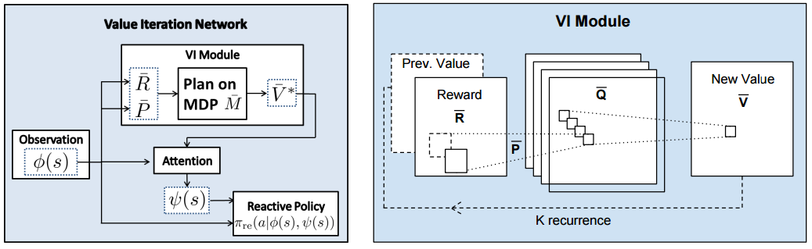
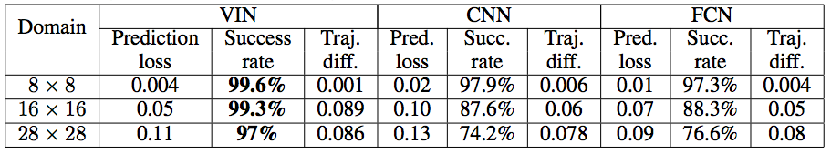

# [Value Iteration Networks](https://arxiv.org/abs/1602.02867) in TensorFlow

> Tamar, A., Wu, Y., Thomas, G., Levine, S., and Abbeel, P. _Value Iteration Networks_. Neural Information Processing Systems (NIPS) 2016

This repository contains an implementation of Value Iteration Networks in TensorFlow which won the Best Paper Award at NIPS 2016. This code is based on the original Theano implementation by the authors.





## Training

- Download the 16x16 and 28x28 GridWorld datasets from the [author's repository](https://github.com/avivt/VIN/tree/master/data). This repository contains the 8x8 GridWorld dataset for convenience and its small size.

```
python3 train.py
```

If you want to monitor training progress change `config.log` to `True` and launch `tensorboard --logdir /tmp/vintf/`. The log directory is `/tmp/vintf/` by default, but can be changed in `config.logdir`. The code currently runs the 8x8 GridWorld model by default.

The 8x8 GridWorld model converges in under 30 epochs with about ~98.5% accuracy. The paper lists that it should be around 99.6% and I was able to reproduce this with the Theano code. The TensorFlow model is not perfect as NaNs result when training with the same parameters as the Theano implementation on the 16x16 and 28x28 domain.

## Dependencies
* Python >= 3.5
* TensorFlow >= 0.12
* SciPy >= 0.18.1 (to load the data)

## Datasets
* The GridWorld dataset used is from the author's repository. It also contains Matlab scripts to generate the dataset. The code to process the dataset is from the original repository with minor modifications under this [license](https://github.com/avivt/VIN/blob/master/LICENSE.md)
* The model was also originally tested on three other domains and the author's original code will be [released eventually](https://github.com/avivt/VIN/issues/4)
  * Mars Rover Navigation
  * Continuous control
  * WebNav

## Resources

* [Value Iteration Networks on arXiv](https://arxiv.org/abs/1602.02867)
* [Aviv Tamar's (author) original implementation in Theano](https://github.com/avivt/VIN)
* [NIPS 2016 Supplemental](http://tx.technion.ac.il/~avivt/nips16supp.pdf)
* [ICML Slides](http://technion.ac.il/~danielm/icml_slides/Talk7.pdf)
